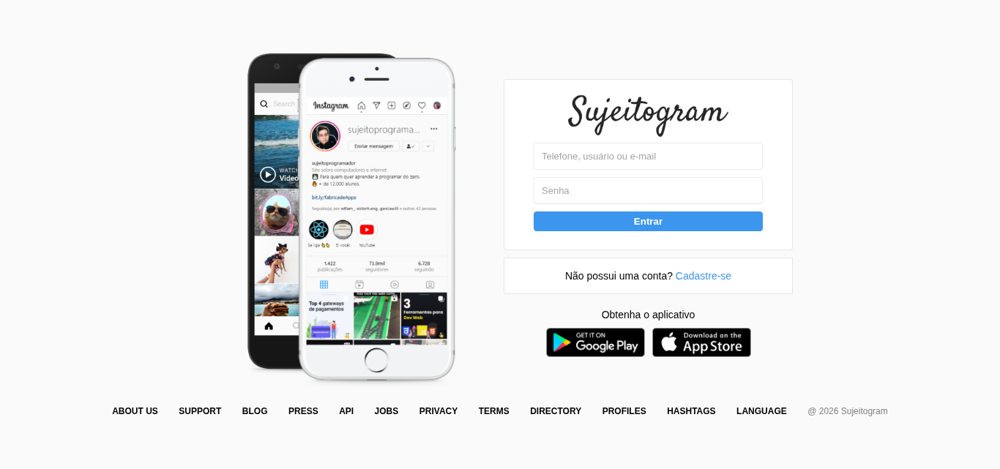
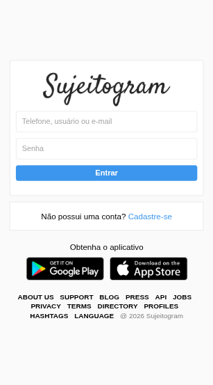

# 📸 Sujeitogram — Instagram Clone

Projeto desenvolvido como parte da minha jornada de aprendizado em **desenvolvimento web**, recriando a interface de login inspirada no Instagram.

O objetivo principal foi praticar a construção de interfaces utilizando **HTML e CSS**, trabalhando principalmente com estruturação de elementos, posicionamento, estilização e organização visual.

## 🌐 Demonstração

Você pode acessar o projeto publicado através do GitHub Pages:

👉 **[🚀 Acessar o Sujeitogram](https://pcfsilva.github.io/02-insta-clone/)**

## 📌 Sobre o projeto

O **Sujeitogram** é uma reprodução visual da interface de login de uma rede social, desenvolvida para fins de estudo e aprendizado.

A interface contém:

* 📸 Logo do Sujeitogram
* 📱 Campo para telefone, usuário ou e-mail
* 🔐 Campo de senha
* 🔑 Área de login
* 📝 Opção para cadastro de uma nova conta
* 📲 Links para instalação do aplicativo
* 🔗 Links complementares no rodapé

A versão publicada apresenta a estrutura visual da página de login.



## 🛠️ Tecnologias utilizadas

* **HTML5**
* **CSS3**

## 🎯 Objetivo do projeto

O principal objetivo foi praticar conceitos fundamentais de **Front-end**, especialmente:

* Estruturação de páginas HTML;
* Criação e organização de formulários;
* Campos de entrada (`input`);
* Links e navegação;
* Estilização com CSS;
* Organização visual dos elementos;
* Posicionamento e espaçamento;
* Criação de interfaces inspiradas em aplicações reais.

## 📂 Estrutura do projeto

```text
02-insta-clone/
│
├── images/
│   └── imagens utilizadas no projeto
│
├── index.html
├── style.css
└── README.md
```

## ▶️ Como executar o projeto

### 1. Clone o repositório

```bash
git clone https://github.com/pcfsilva/02-insta-clone.git
```

### 2. Acesse a pasta

```bash
cd 02-insta-clone
```

### 3. Execute o projeto

Abra o arquivo `index.html` no navegador.

Também é possível utilizar o **Live Server** no Visual Studio Code para executar o projeto em um servidor local.

### Utilizando o Live Server

1. Abra o projeto no Visual Studio Code.
2. Abra o arquivo `index.html`.
3. Clique com o botão direito.
4. Selecione **Open with Live Server**.
5. O projeto será aberto automaticamente no navegador.

## 🚀 Deploy

O projeto está publicado através do **GitHub Pages**.

🔗 **Projeto online:**

https://pcfsilva.github.io/02-insta-clone/

## 📚 O que aprendi com este projeto

Este projeto foi importante para reforçar conhecimentos de desenvolvimento Front-end e entender melhor como interfaces utilizadas em aplicações reais podem ser estruturadas.

Durante o desenvolvimento, pratiquei:

* HTML5;
* CSS3;
* Formulários;
* Inputs;
* Links;
* Estruturação de layouts;
* Organização de arquivos;
* Estilização de interfaces;
* Publicação de projetos com GitHub Pages.

## ⚠️ Aviso

Este projeto foi desenvolvido **exclusivamente para fins educacionais**.

Ele não possui relação oficial com o Instagram ou com a Meta e não deve ser utilizado para coleta de dados reais de usuários.

## 👨‍💻 Autor

**Pc Silva**

GitHub: [@PcfSilva](https://github.com/pcfsilva)

---

⭐ Se você gostou do projeto, considere deixar uma estrela no repositório!

**Mais um projeto concluído na minha jornada de aprendizado em desenvolvimento web. 🚀**
